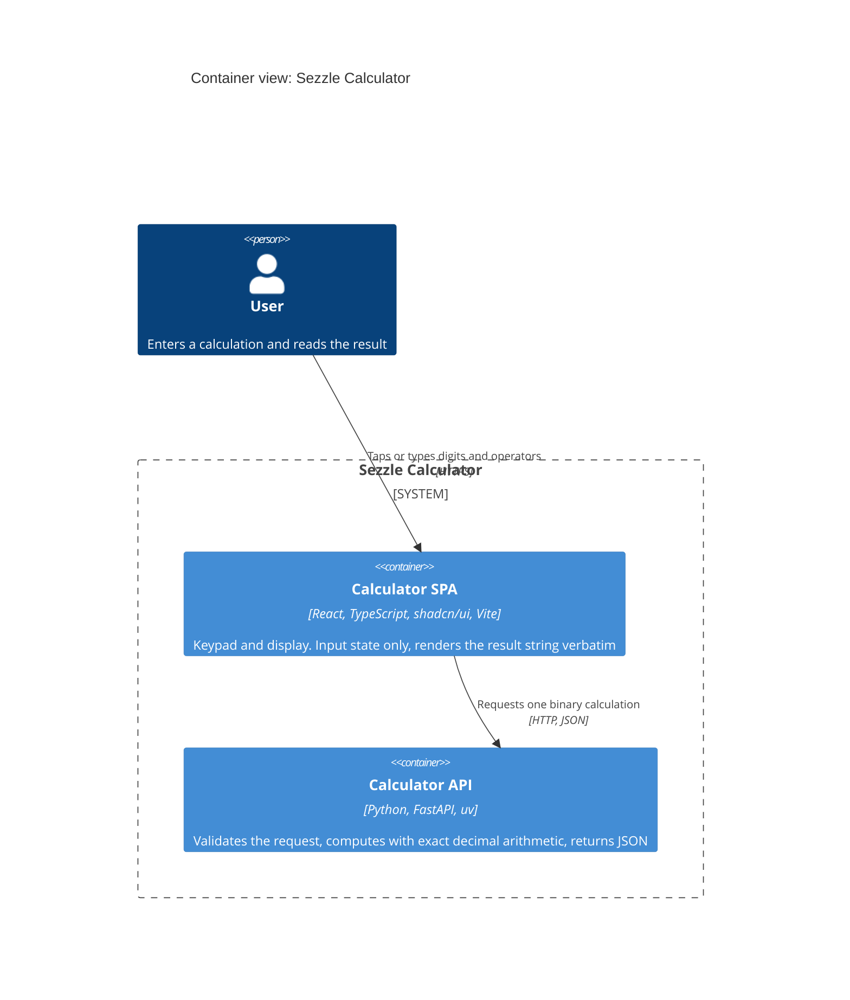
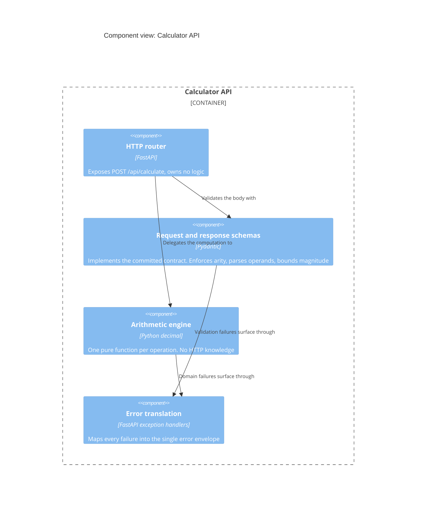
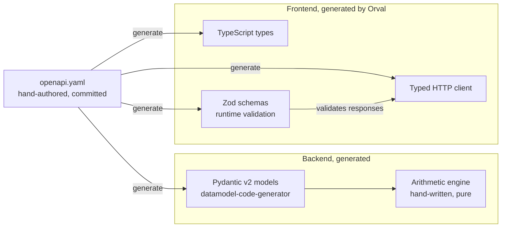
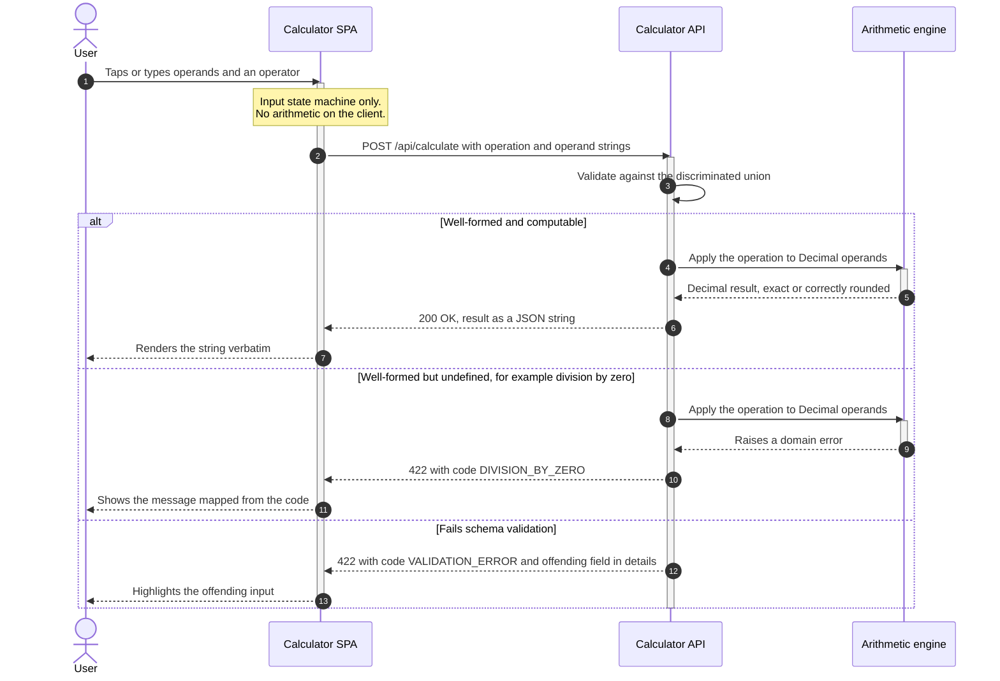
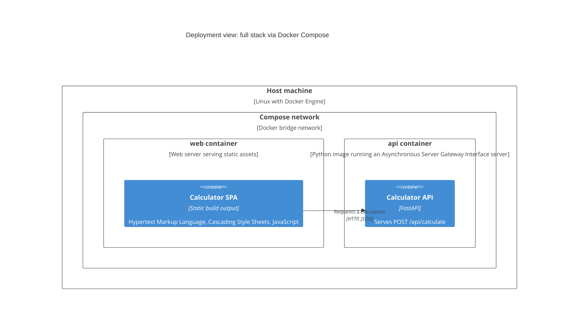

# Architecture

A collapsed arc42; mapping in [`CLAUDE.md`](CLAUDE.md). Rationale lives in
[`decisions/`](decisions/) and is linked, never repeated. Requirements cited from
[`sources/assignment-brief.md`](sources/assignment-brief.md).

## 1. Introduction and goals

A React calculator keypad collects input; a Python backend computes and returns JavaScript
Object Notation (JSON). Seven operations: the four required plus the three the brief marks
optional, all in scope. Stakeholders are one author and one Sezzle evaluator. The brief's
"prioritize correctness, clarity, and maintainability over extra features" is the strongest
constraint here: anything unasked for is a defect, not a bonus.

### 1.1 Requirements trace

| Requirement | Satisfied by |
|---|---|
| React frontend, seven operations, responsive input | § 5.1, § 5.2, § 5.3 |
| Validation, error handling, edge cases, both layers | § 8.3, [ADR-0005](decisions/0005-error-model-and-status-codes.md) |
| Representational State Transfer (REST) endpoint, JSON results | [ADR-0003](decisions/0003-single-calculate-endpoint.md), [ADR-0004](decisions/0004-exact-decimal-arithmetic.md) |
| Unit tests, coverage, Docker running both layers | § 8.4, § 7 |

### 1.2 Quality goals

| # | Goal | Meaning here |
|---|---|---|
| G1 | Correctness | Numeric exactness, every edge case defined |
| G2 | Clarity | Scannable in minutes |
| G3 | Testability | The brief asks for "testable architecture" |
| G4 | Maintainability | A new operation is a small, safe change |
| G5 | Usability | Clear errors, usable on a phone |

## 2. Constraints

| Category | Constraint | Effect |
|---|---|---|
| Technical | Frontend must be React | Non-negotiable. TypeScript and shadcn/ui adopted, [ADR-0006](decisions/0006-shadcn-ui-component-library.md) |
| Technical | Backend "Go is preferred" | Departed from deliberately, [ADR-0002](decisions/0002-python-fastapi-instead-of-go.md) |
| Technical | Separate frontend and backend processes | Resolved by same-origin proxying, § 8.5 |
| Technical | **The frontend holds no business rules.** Its role is to display data | Governs what the frontend may contain, not just how it is built. Consequences in § 5.3 and § 8.3 |
| Organizational | 2 to 4 hour budget, deadline 2026-09-03 | Dominant. No time to ask questions, so ambiguities become assumptions, § 11.3 |
| Organizational | Public repository, prompts shared | No credentials anywhere. The commit history is visible |
| Convention | `just` for all commands | No command exists only in a README |

## 3. Context and scope

One human actor, no external systems, no persistence, no third-party call at runtime. A C4
(context, container, component, code) *system context* diagram is deliberately omitted: one
actor and zero external systems would restate the container view with less information.

### 3.1 Container view

### 3.2 External interfaces

The user reaches the single-page application (SPA) over Hypertext Transfer Protocol Secure
(HTTPS); the SPA calls the API over HTTP with JSON at `POST /api/calculate`.

Two semantics the contract fixes. **Percentage** is `percent(a, b) = a / 100 * b`, so
`percent(20, 50)` is `10`, sitting on the keypad as a binary operator like division rather than
as the context-sensitive postfix percent of physical calculators, whose meaning depends on the
pending operator and which surprises people. **A negative base with a fractional exponent is a
domain error**, since the real-valued result does not exist.

**Operands are bounded, and the contract declares the bound**: at most 25 integer and 25
fractional digits, in plain notation, with scientific notation excluded because a keypad cannot
produce it and excluding it leaves one parsing rule instead of two. An oversized operand fails
as `OPERAND_OUT_OF_RANGE` before any arithmetic runs.

The exponent of `power` carries a tighter bound of its own, under 10000 in magnitude, which is
why `openapi.yaml` splits exponentiation into its own request shape. The base may be as large as
any operand, so the exponent is the single input that could otherwise make the server work
indefinitely. Bounding it in the contract turns a potential timeout into a validation error, and
because both layers generate from that contract, the bound is written once and enforced on both
sides.

## 4. Solution strategy

Correctness (G1) rests on exact base-10 arithmetic with strings on the wire
([ADR-0004](decisions/0004-exact-decimal-arithmetic.md)) and every failure mode behind a stable
code ([ADR-0005](decisions/0005-error-model-and-status-codes.md)). Clarity (G2) rests on one
hand-authored contract ([ADR-0007](decisions/0007-api-first-openapi-contract.md)) with every
wire type generated from it ([ADR-0008](decisions/0008-generate-all-wire-types.md)).
Testability (G3) rests on an engine of pure functions (§ 5.2), maintainability (G4) on one
endpoint plus an operation registry
([ADR-0003](decisions/0003-single-calculate-endpoint.md)), usability (G5) on accessible
components ([ADR-0006](decisions/0006-shadcn-ui-component-library.md)). The language choice is
argued in [ADR-0002](decisions/0002-python-fastapi-instead-of-go.md).

**Working method: contract, then generated types, then tests, then implementation.** The two
ideas fit together rather than competing. `openapi.yaml` is authored first and both layers'
wire types are generated from it, so API and client tests are contract-derived. The arithmetic
engine owes nothing to the contract, being pure functions over `Decimal`, so it stays genuinely
test-first: red, green, refactor. Commits stay one logical change each, since the public
history is part of what an evaluator sees. Intended discipline, not a claim about every commit.

**`just dev` takes a clean clone to a running application**, installing both layers and running
them on the host. A developer, continuous integration, and an agent all enter through the same
`just` recipes, so there is no second, undocumented way to build or test this project: the DRY
rule applied to commands, per
[`.claude/rules/principles.md`](../.claude/rules/principles.md).

## 5. Building block view

### 5.1 Level 1: containers

The **Calculator SPA** (React, TypeScript, shadcn/ui, Vite) collects input, calls the API, and
renders the result or the error the backend returned; it knows the contract, owns presentation,
and holds no rule of its own (§ 2). The **Calculator API** (Python, FastAPI, uv) validates, computes, and responds, and
is the single authority on correctness. **The frontend performs no arithmetic at all**, which
§ 5.3 explains a keypad does not change.

### 5.2 Level 2: inside the Calculator API

The load-bearing property: **the arithmetic engine knows nothing about HTTP.** It takes
`Decimal` values and returns a `Decimal` or raises a domain error, making the interesting
logic testable without a client, a server, or a network (G3).

### 5.3 Level 2: the keypad and its input state

A keypad (digits, decimal point, operators, equals, clear), operable by tap or physical
keyboard, built from shadcn/ui components generated into this repository
([ADR-0006](decisions/0006-shadcn-ui-component-library.md)).

It requires a small **input state machine**: current operand buffer, pending operator,
accumulated left operand, and a flag for whether the display holds a result the next digit
should replace. **This is input state only.** It never evaluates anything, it decides when to
ask the backend, and it chains on the exact value the API returned rather than on the rounded
string displayed (§ 8.2). It holds no validation logic and no arithmetic semantics: those belong
to the contract and the backend, per the § 2 constraint. Every evaluation remains one HTTP
request for one binary operation, so the frontend performs no arithmetic and
[ADR-0003](decisions/0003-single-calculate-endpoint.md) is untouched. A reviewer seeing a keypad
will reasonably wonder whether the client started computing; it did not.

Two behaviours follow, and they are where keypads usually go wrong.
**Operator-after-operator** replaces the pending operator rather than stacking it: input state,
so allowed. **Pressing equals twice does nothing**, because repeat-on-equals is a rule about what
an operation means when reapplied. That is arithmetic semantics, forbidden here, and putting it
in the backend would need the API to hold session state, which ADR-0003 rules out. The behaviour
is absent rather than placed in the wrong layer: a smaller product and a cleaner one, justified
by a rule rather than by the budget.

### 5.4 The contract and what is generated from it

Nothing describing the wire format is hand-written on either side; the arithmetic engine is
the one hand-written piece and owes nothing to the contract. Zod matters because generated
TypeScript types are erased at build time: they constrain what the frontend sends and check
nothing about what it receives, so runtime validation at the boundary is the only place the
contract is tested against reality rather than against a generator
([ADR-0008](decisions/0008-generate-all-wire-types.md),
[ADR-0007](decisions/0007-api-first-openapi-contract.md)).

## 6. Runtime view

Both failure branches return the same envelope and status. The frontend branches on `code`,
never on prose or status alone.

## 7. Deployment and continuous integration

**Development is host-native.** `just dev` runs both layers as host processes: nothing is
containerised and nothing is built, so the inner loop is as fast as the tools allow and the
unit tests that test-driven development runs hundreds of times are not routed through a
container for no return.

**Docker Compose runs the assembled stack** under its own recipe, with two jobs: giving an
evaluator one command that needs no toolchain, and hosting the smoke test (§ 8.4). Nothing is
mounted, so the images are plain build-and-run and the frontend is a production build served
statically. One hazard belongs here because it is what makes a first run fail: a server inside
a container must bind `0.0.0.0`, not localhost, or the published port reaches nothing.

Deliberately absent: reverse proxy, Transport Layer Security termination, orchestrator,
persistence.

### 7.1 Continuous integration gates

GitHub Actions runs on every push. Five gates block, one advises. This is the single list;
anywhere else that mentions the gates links here.

| Gate | Blocking | Why |
|---|---|---|
| Tests and coverage, both layers | Yes | Correctness, a graded deliverable |
| End-to-end smoke test | Yes | The composition claim, § 8.4 |
| OpenAPI drift, generated against committed | Yes | What makes the contract real |
| Backend and frontend generated artefacts fresh | Yes | Committed generated code must not go stale |
| Lint and format, Ruff and Biome | Yes | Cheap and deterministic |
| Type check, `ty` | **No** | Pre-1.0 and unpinned, so a regression could redden a public repository mid-evaluation. Errors still surface in the job output, [ADR-0009](decisions/0009-toolchain.md) |

## 8. Crosscutting concepts

### 8.1 The contract and generated types

`openapi.yaml` is hand-authored and committed; the backend implements it, the frontend's
types are generated from it, and continuous integration fails on drift in either direction
([ADR-0007](decisions/0007-api-first-openapi-contract.md)).

### 8.2 Numeric handling

Exact base-10 arithmetic via `decimal.Decimal` at 28 significant digits with
`ROUND_HALF_EVEN` (banker's rounding). Operands and results cross the wire as JSON strings,
never JSON numbers, so the client cannot silently reintroduce binary floating-point error when
parsing ([ADR-0004](decisions/0004-exact-decimal-arithmetic.md)). The invariant that must
never break: the frontend renders the result string as received, never via `Number()`.

**Full precision end to end; rounding is display only.** The API returns the exact value and the
frontend rounds to two decimal places for presentation alone. Rounding inside the contract was
rejected because it would make `1/8` return `0.12`, `sqrt(2)` return `1.41`, and `1/3` then times
three return `0.99` instead of `1`.

The boundary matters more than the choice: **the state machine chains on the exact value the API
returned, never on the rounded string on screen.** Displaying `0.33` while carrying `0.3333...`
into the next operation is the difference between a calculator that composes and one that
drifts. Computation owns the value, presentation owns its appearance, and presentation never
feeds back (see [`.claude/rules/principles.md`](../.claude/rules/principles.md)).

That is not a breach of the § 2 constraint, though it can look like one. A business rule changes
what the answer is; a formatting choice changes only how it is shown.

### 8.3 Validation and error handling

The backend is the only authority: schema validation, then domain validation in the engine.
Every failure leaves through one envelope with a stable `code`
([ADR-0005](decisions/0005-error-model-and-status-codes.md)).

Because the frontend holds no rules of its own (§ 2), it validates with the Zod schemas Orval
generates from the contract ([ADR-0008](decisions/0008-generate-all-wire-types.md)), never
hand-written checks, duplicated bounds, or a local list of operations. That satisfies the brief's
frontend-validation requirement while keeping the constraint intact: the frontend enforces the
contract's rules, it does not own them. For the same reason the **backend owns the error
wording**; the frontend branches on `code` for behaviour and renders `message` for the user.

### 8.4 Testing

Engine tests carry the most value per minute, being pure functions with no input or output:
each operation, exactness (`0.1 + 0.2` is exactly `0.3`), and each domain error, written
test-first. API tests derive from the contract. Frontend tests cover the input state machine (a second equals does nothing,
operator-after-operator replaces the pending operator), rendering, and that the error `message`
from the response is what reaches the user.
Coverage is reported for both layers and **no threshold blocks anywhere**: the brief asks for
a coverage report, not a target, and a number reported without one having been aimed at is
worth more than a number a gate forced upward.

**Exactly one end-to-end test**, in Playwright against the Compose stack: type `0.1`, `+`,
`0.2`, `=`, and assert the display reads exactly `0.3`. It is the only artefact proving that
[ADR-0004](decisions/0004-exact-decimal-arithmetic.md)'s exactness survives every hop: engine,
error envelope, contract, generated client, runtime validation, rendering. Unit tests prove
each hop in isolation; this proves the composition. A larger suite is deliberately rejected,
since the brief asks for unit tests and prioritises correctness over extra features.

The frontend's runtime Zod validation is **not** a test. It is a production guard on every
response, and the two should not be confused.

### 8.5 Same-origin by construction

**The frontend always calls a same-origin relative path**, proxied to the backend by the Vite
development server in development and by the static file server in the Compose stack. The
backend therefore needs no Cross-Origin Resource Sharing configuration at all, and the frontend
never holds an absolute backend address.

This removes the problem rather than configuring around it (see
[`.claude/rules/principles.md`](../.claude/rules/principles.md)): nothing cross-origin to get
wrong, no environment-specific address in the bundle, one code path instead of two. It costs a
proxy rule in two configuration files.

## 9. Architecture decisions

Nine records, all Accepted, in [`decisions/`](decisions/), catalogued with one-line summaries
in [`index.md`](index.md). Not restated here: `decisions/` is the authoritative home and a
second index of it would be the duplication
[`.claude/rules/principles.md`](../.claude/rules/principles.md) forbids.

## 10. Quality requirements

| # | Goal | Scenario | Response |
|---|---|---|---|
| Q1 | G1 | Compute `0.1 + 0.2` | Displays exactly `0.3` |
| Q2 | G1 | Divide by zero | 422, code `DIVISION_BY_ZERO`. No stack trace, no 500 |
| Q3 | G3, G4 | Add a binary operation | Contract entry, one enum member, one pure function, plus tests. No new route |
| Q4 | G5 | Keypad at phone width | Usable without horizontal scrolling; every key reachable from the keyboard |
| Q5 | G1 | Backend drifts from the contract | Continuous integration fails before merge |
| Q6 | G1 | Compute one divided by three, then times three | Display reads `1.00`, not `0.99`. The only scenario that catches the display rounding of § 8.2 leaking back into computation |
| Q7 | G4 | Add an operation to `openapi.yaml` and regenerate | It reaches the frontend with no hand-written frontend change. Asserts the property the § 2 constraint buys |

## 11. Risks, technical debt, and assumptions

### 11.1 Risks

- Evaluator treats "Go is preferred" as required. High impact, accepted not eliminated;
  argued in [ADR-0002](decisions/0002-python-fastapi-instead-of-go.md).
- Generation and contract tooling consume budget the tests needed. Engine tests come first.
- String operands read as unusual. Explained in the README's API section.
- 422 for division by zero reads as wrong to a reviewer expecting 400. Argued in
  [ADR-0005](decisions/0005-error-model-and-status-codes.md).
- Documentation disproportionate to the exercise. Scope capped at one architecture file, nine
  ADRs, a README.
- **`ty` is pre-1.0 and unpinned**, so a breaking release could redden continuous integration
  on a public repository mid-evaluation. Mitigated by making that step non-blocking (§ 7.1).

### 11.2 Technical debt

Accepted knowingly on budget grounds. None was requested by the brief.

- No calculation history or persistence.
- No operator precedence: the keypad evaluates one binary operation per press, so `2 + 3 * 4`
  follows keypad order, not mathematical precedence.
- No rate limiting, authentication, or observability.
- End-to-end coverage is one smoke test (§ 8.4). Error paths, keyboard input and responsive
  behaviour are covered by unit tests instead.
- No development container: one author on Linux, with `uv` and `pnpm` already providing
  isolation, so it would add a layer for a benefit that needs a team to be worth anything.
- Error messages are English only. The backend owns the wording (§ 8.3), so translating means
  translating there, not adding a string table to the frontend.

### 11.3 Assumptions

What remains genuinely undecided at submission, as opposed to decided and documented
elsewhere. One item qualifies.

| Ambiguity | Assumption taken |
|---|---|
| "Microservice" is ambiguous | One backend process called over HTTP, not several services. Nobody ruled on this: it is a reading of the brief's wording, and being wrong about it would not change the system |

Everything else that once sat here has been decided and moved to where a reader meets it as a
property of the system: percentage semantics, operand bounds and the negative-base exponent rule
to § 3.2, and precision with display-only rounding to § 8.2. A settled assumption is not an
assumption, and listing one would understate what this submission knows.
